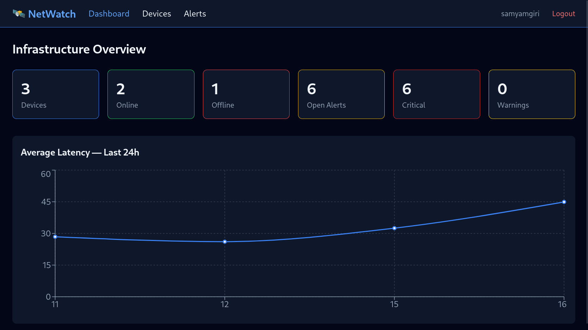
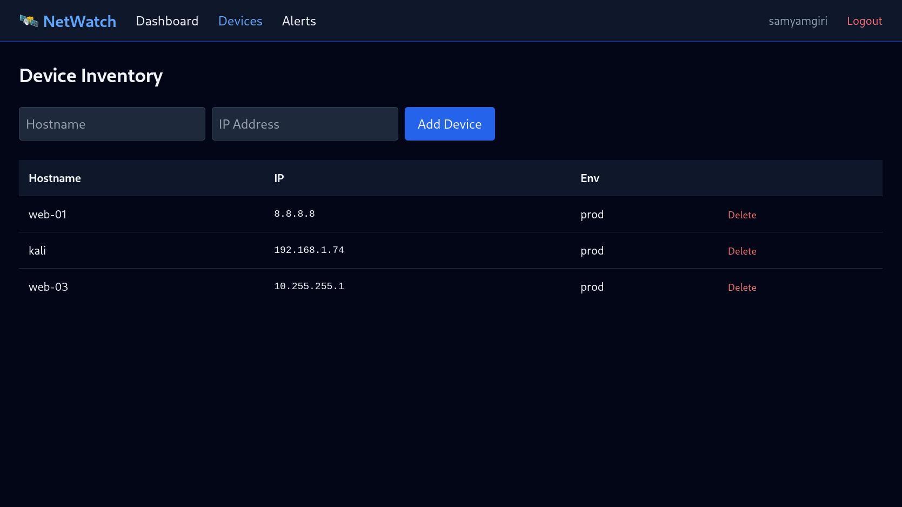

# 🛰 NetWatch

A modern **Network Monitoring & Infrastructure Management Platform** built with **FastAPI, React, TypeScript, PostgreSQL, Docker, and SQLAlchemy**.

NetWatch continuously monitors servers, websites, and network infrastructure by performing automated health checks including **ICMP Ping, TCP Port Monitoring, HTTP/HTTPS Monitoring, DNS Resolution, SSL Certificate Validation**, and **Intelligent Alert Generation**. It provides a modern web dashboard for infrastructure monitoring with secure authentication, historical monitoring data, and automated background checks.

> Designed as a portfolio-ready full-stack project demonstrating backend development, frontend development, database management, network programming, authentication, and system monitoring.

---

# 📑 Table of Contents

- [✨ Features](#-features)
- [📷 Screenshots](#-screenshots)
- [🏗 Architecture](#-architecture)
- [🛠 Tech Stack](#-tech-stack)
- [📂 Project Structure](#-project-structure)
- [⚙ Monitoring Workflow](#-monitoring-workflow)
- [🔒 Security](#-security)
- [📈 Monitoring Capabilities](#-monitoring-capabilities)
- [🚀 Getting Started](#-getting-started)
- [📖 API Documentation](#-api-documentation)
- [🎯 Key Highlights](#-key-highlights)
- [🚀 Future Improvements](#-future-improvements)
- [📚 Learning Outcomes](#-learning-outcomes)
- [📄 License](#-license)

---

# ✨ Features

## 🔐 Authentication & Authorization

- JWT Authentication
- Secure password hashing using bcrypt
- Role-Based Access Control (RBAC)
- Protected REST APIs
- User Registration
- User Login
- Authenticated profile endpoint

---

## 🖥 Device Inventory Management

Manage all infrastructure assets from a centralized interface.

Features include:

- Add monitored devices
- Update device information
- Delete devices
- Enable/Disable monitoring
- Store:
  - Hostname
  - IP Address
  - Domain Name
  - Operating System
  - Environment
  - Owner
  - Description
  - Service Ports

---

## 📡 Automated Infrastructure Monitoring

NetWatch continuously monitors registered infrastructure using a background scheduler.

Implemented monitoring includes:

- ✅ ICMP Ping Monitoring
- ✅ TCP Port Monitoring
- ✅ HTTP/HTTPS Availability Monitoring
- ✅ DNS Record Monitoring
- ✅ SSL Certificate Monitoring

Every monitoring cycle is automatically stored in PostgreSQL for historical analysis.

---

## 🚨 Intelligent Alert Engine

Automatically detects infrastructure failures and generates alerts.

Current alert rules include:

- Host unreachable
- TCP service unavailable
- HTTP application failures
- SSL certificate expiration warnings

Features:

- Automatic alert creation
- Duplicate alert prevention
- Automatic alert resolution
- Warning & Critical severity levels
- Alert history tracking

---

## 📊 Dashboard

The React dashboard provides an overview of monitored infrastructure.

Features include:

- Total monitored devices
- Online devices
- Offline devices
- Active alerts
- Monitoring summaries
- Recent activity
- Device management
- Alert management

---

## 📈 Historical Monitoring Data

Every monitoring cycle is stored inside PostgreSQL, allowing historical analysis of:

- Ping latency
- Port availability
- HTTP responses
- DNS records
- SSL certificate status
- Generated alerts

---

## ⚡ Background Scheduler

Monitoring runs automatically without user interaction.

Features:

- APScheduler integration
- Periodic monitoring jobs
- Automatic device scanning
- Continuous health checking
- Non-blocking background execution

---

# 📷 Screenshots

## Dashboard



---

## Device Inventory



---

## Alert Management


---

# 🏗 Architecture

```text
                   React + TypeScript
                           │
                           ▼
                FastAPI REST Backend
                           │
     ┌─────────────────────┼─────────────────────┐
     │                     │                     │
     ▼                     ▼                     ▼
Authentication      Monitoring Engine      Alert Engine
     │                     │                     │
     └─────────────────────┼─────────────────────┘
                           │
                   APScheduler Jobs
                           │
      ┌──────────┬──────────┬──────────┬──────────┬──────────┐
      ▼          ▼          ▼          ▼          ▼
    Ping      TCP Port     HTTP       DNS        SSL
                           │
                           ▼
                   PostgreSQL Database
                           │
                           ▼
                    React Dashboard
```

---

# 🛠 Tech Stack

## Backend

- FastAPI
- SQLAlchemy
- Alembic
- APScheduler
- PostgreSQL
- JWT
- Passlib (bcrypt)
- Ping3
- HTTPX
- dnspython
- Pydantic

---

## Frontend

- React
- TypeScript
- Vite
- React Query
- Axios

---

## Database

- PostgreSQL

---

## DevOps

- Docker
- Docker Compose

---

## Development Tools

- Python 3.13
- Node.js
- Git
- Swagger UI

---

# 📂 Project Structure

```text
NetWatch/
│
├── backend/
│   ├── alembic/
│   ├── app/
│   │   ├── api/
│   │   ├── authentication/
│   │   ├── middleware/
│   │   ├── models/
│   │   ├── scheduler/
│   │   ├── schemas/
│   │   ├── services/
│   │   ├── utils/
│   │   ├── config.py
│   │   └── main.py
│   │
│   ├── tests/
│   ├── logs/
│   ├── requirements.txt
│   └── Dockerfile
│
├── frontend/
│
├── docker/
├── nginx/
├── prometheus/
├── grafana/
│
└── README.md
```

---

# ⚙ Monitoring Workflow

```text
          Device Registered
                  │
                  ▼
      Background Scheduler
                  │
                  ▼
      Monitoring Services
      ├── Ping
      ├── TCP Port
      ├── HTTP
      ├── DNS
      └── SSL
                  │
                  ▼
      PostgreSQL Database
                  │
                  ▼
         Alert Engine
                  │
                  ▼
      React Dashboard
```

---

# 🔒 Security

NetWatch incorporates modern security practices including:

- JWT Authentication
- Password hashing with bcrypt
- Protected REST APIs
- Role-Based Authorization
- Request validation using Pydantic
- SQLAlchemy ORM protection against SQL injection
- Environment-based configuration

---

# 📈 Monitoring Capabilities

| Module | Status |
|---------|:------:|
| JWT Authentication | ✅ |
| Role-Based Access Control | ✅ |
| User Registration/Login | ✅ |
| Device CRUD | ✅ |
| PostgreSQL Integration | ✅ |
| Alembic Database Migrations | ✅ |
| Background Scheduler | ✅ |
| Ping Monitoring | ✅ |
| TCP Port Monitoring | ✅ |
| HTTP Monitoring | ✅ |
| DNS Monitoring | ✅ |
| SSL Monitoring | ✅ |
| Alert Engine | ✅ |
| Alert Management | ✅ |
| Dashboard | ✅ |
| Monitoring History | ✅ |
| REST APIs | ✅ |
| Swagger Documentation | ✅ |

---

# 🚀 Getting Started

## Clone the Repository

```bash
git clone https://github.com/YOUR_USERNAME/netwatch.git

cd netwatch
```

---

## Backend Setup

```bash
cd backend

python3 -m venv venv

source venv/bin/activate

pip install -r requirements.txt
```

Create a `.env` file with the required environment variables.

Run database migrations.

```bash
alembic upgrade head
```

Start the backend.

```bash
uvicorn app.main:app --reload
```

---

## Frontend Setup

```bash
cd frontend

npm install

npm run dev
```

---

# 📖 API Documentation

After starting the backend, interactive API documentation is available at:

```
http://localhost:8000/docs
```

Swagger UI allows testing all REST endpoints directly from the browser.

---

# 🎯 Key Highlights

- ✅ Full-stack application using FastAPI and React
- ✅ Modern REST API architecture
- ✅ JWT Authentication
- ✅ Role-Based Access Control
- ✅ PostgreSQL with Alembic migrations
- ✅ Automated background monitoring
- ✅ Multiple network monitoring protocols
- ✅ Intelligent alert generation
- ✅ Historical monitoring data
- ✅ Responsive React dashboard
- ✅ Docker-ready development environment
- ✅ Portfolio-ready project architecture

---

# 🚀 Future Improvements

Potential enhancements include:

- Email notifications
- Telegram notifications
- Slack notifications
- Prometheus metrics export
- Grafana dashboards
- Real-time WebSocket updates
- Historical analytics and charts
- Custom alert rules
- Monitoring reports
- Multi-tenant support
- Notification escalation policies
- Dark mode

---

# 📚 Learning Outcomes

This project demonstrates practical experience with:

- Backend Development using FastAPI
- React & TypeScript
- REST API Design
- JWT Authentication
- SQLAlchemy ORM
- Alembic Database Migrations
- PostgreSQL
- Background Task Scheduling
- Network Programming
- ICMP Networking
- TCP Socket Programming
- HTTP Monitoring
- DNS Resolution
- SSL/TLS Certificate Validation
- Alert Detection Systems
- Docker-based Development
- Full-stack Software Architecture

---

# 📄 License

This project was developed for educational and portfolio purposes.

Feel free to fork, learn from, and extend the project.